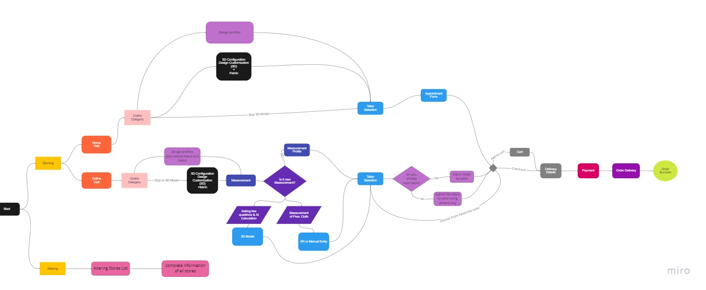

# Software Requirement Specification

## Tech Stack: 

- UI/UX & Prototyping - Figma		
- Frontend: React + TailwindCSS / Material UI
- Backend - Nodejs + Expressjs + Mongoose
- Database - MongoDB

## Hosting & Deployment : 

- Site Hosting: Vercel / Firebase / Hostinger
- Server Hosting: Heroku

## Project Management:

- Git + Github

## DevOps : 

- Docker, Jenkins, Kubernetes, GitHub Action.

## Addon : 

- Threejs
- React Three fiber (3-d Product configuration)
- Blender
- [Marvelous Designer](https://marvelousdesigner.com/)
- Google AR Core

## Addon : 
- Spline
- GSAP

## Additional API : 
- [Google AR Core](https://developers.google.com/ar)

## Tailor side:
- Ongoing Project
  - 3D
  - 2D
  - Order details
  - tracking
- Completed Projects
- Awaiting Approval
  - Brief Details
  - Order ID
  - accept/reject
- Earnings
  - List of Earnings
- Profile (edit)
  - Profile Name
  - Address
  - Number
  - Description
  - Tags (expertise)
- Favorite tailor option
- Currently available or not status

 

## Customer Side : 
- Stitching
  - Home
    - Category
    - Fabric or design 3D model
    - tailors
  - Online visit
    - Category
      - Gender
      - clothes
    - Fabric or design 3D model
    - Measurement
    - Tailors selection (acceptance ratio - ratio of orders offered vs accepted)
      - Add to cart
      - Checkout
      - Delivery details
      - Payment
- Altering
  - Altering stores list ( list only! Not through the site)
- Store concept - In Next version

## **FlowChart :**

[**Flowchart Link**](https://miro.com/app/board/uXjVP0ktk8g=/)

 

# Specification : 
 ## 1. MENS
 **(Wedding, Festive, Party, Casual,Office)**
 
 **References:** 
 - https://www.suitsexpert.com/blog/mens-dress-shirt-guide/
 - https://www.tailorman.com/shirts/show-all/products/ 

1. **Shirts**
   1. **Casual**
   2. **Formal**
   3. **Custom**
   4. **Uniform**

2. **Suits**

   1. **Sleeveless(vests)**
   2. **Regular Coat/Suit**
   3. **Blazer**

3. **Trousers**
4. **Kurtas**

## 2. **WOMENS**
**(Wedding,Festive,Party,Casual,Office)**

**References:** [**https://www.cloudtailor.com/**](https://www.cloudtailor.com/)

1. **Lehenga**

   1. **Party Wear**
   2. **Formal wear**

2. **Kurti**

   1. **Formal Wear**
   2. **Informal/General Purpose**

3. **Suits(vests)/Coats**

   1. **Formals**
   2. **Party Wear**

4. **Shirts**

   1. **formals**

5. **Suit Salwar**
6. **Blouse**
7. **Pant/Trouser**
8. **Skirt**

## **Clothing Fabric Patterns**

**References:**
1. [**https://www.tailorman.com/shirts/show-all/products/**](https://www.tailorman.com/shirts/show-all/products/)
2. [**https://www.fabricsight.com/blogs/posts/fabrics-for-trousers-top-10-fabrics-for-your-trousers-complete-guide**](https://www.fabricsight.com/blogs/posts/fabrics-for-trousers-top-10-fabrics-for-your-trousers-complete-guide)
3. [**https://fabriclore.com/collections/lehenga**](https://fabriclore.com/collections/lehenga)

- **Shirt Fabrics**

1. **Cotton**
2. **Cotton-mixed**
3. **Wool**
4. **Linen**
5. **Silk**

- **Suits/Coats/Wests**

1. **Cotton**
2. **Synthetic**
3. **Linen**
4. **Mohair**
5. **Vicuna**
6. **Polyester**
7. **Velvet**
8. **Tweed**
9. **Camel hair**
10. **Tartan**

- **Pants/Trousers**

1. **Cotton**
2. **Linen/Cotton Blend**
3. **Recycled Wool**
4. **Satin**
5. **Stretch wool**
6. **Cotton Twill**

- **Lehenga/ Kurti/ Suit Salwar**

1. **Georgette**
2. **Brocade**
3. **Kalamkari**
4. **Crepe or net**
5. **Chiffon**
6. **Cotton blend**
7. **Velvet**
8. **Organza**
9. **Silk**
10. **Chanderi**
11. **Banarasi**

- **Dress**

1. **Velvet**
2. **Poplin**
3. **Voile**
4. **Georgette**
5. **Muslin**
6. **Chiffon**
7. **kalamkari**

- **Blouse**

1. **Georgette**
2. **Velvet**
3. **Organza**
4. **Chiffon**
5. **Terrycloth**
6. **Brocade**
7. **Banarasi**
8. **Raw**
9. **Munga**
10. **Cotton Silk**
11. **Cotton Raw**

- **Skirt**

1. **Crepe or net**
2. **Velvet**
3. **Tartan**
4. **Poplin**
5. **Denim**
6. **Corduroy**
7. **Flannel**
8. **Gabardine**
9. **Challis**

# **Project Stakeholders**

- **Customer**

- **Tailors**

- **Administrators**

- **Delivery Stakeholders**

# **TIME ESTIMATION :**

- **8 Jan Pitch Deck**
- **15 Jan Design**
- **15 Jan Prototype**
- **18 Jan Feedback**
- **Frontend - 5 Feb**
- **Backend - 15 Feb**
- **19 Feb - Testing**
- **Deployment - 21 Feb**
- **25 Feb - betaa**
- **26 Feb Documentation**

# **Pitch Deck -** 
### [Pitch Deck](https://www.canva.com/design/DAFXEeGDTf8/WamnrOFrE7t8zwBY1EQhEw/view?utm_content=DAFXEeGDTf8&utm_campaign=designshare&utm_medium=link&utm_source=publishpresent)
